# LARA — LLM-Assisted Response and Analysis
### AI-Augmented SOC Automation Pipeline | BEng (Hons) Cyber Security Dissertation Project

> **Splunk → n8n → GPT-4.1 Mini → AbuseIPDB + VirusTotal → DFIR-IRIS → Slack**

An end-to-end Security Operations Centre (SOC) automation pipeline that integrates a SIEM, SOAR platform, Large Language Model (LLM), external threat intelligence enrichment, automated case management, and real-time analyst notification — evaluated across three pipeline configurations with formal performance testing.

---

## Pipeline Architecture

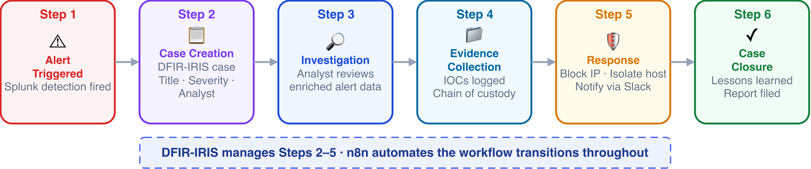

---

## What makes this different

Most SOC automation lab projects demonstrate that a pipeline *works*. This project goes further by **formally evaluating whether it works better** — and by how much.

Three pipeline configurations were tested against five simulated attack scenarios across 15 controlled runs:

| Metric | Manual Baseline | LLM-Only | Fully Integrated |
|---|---|---|---|
| **Avg. Triage Time** | 209s | 130s | 38.1s |
| **Time Reduction** | — | ↓ 38% | ↓ 82% |
| **Action Quality** | 3.0 / 5 | 4.0 / 5 | 4.57 / 5 |
| **Context Quality** | 3.6 / 5 | 3.0 / 5 | 4.29 / 5 |
| **Analyst Steps** | 6.6 avg | 3.0 avg | 3.6 avg |
| **Classification Accuracy** | 100% | 100% | 100% |

The central finding: **orchestration depth, not model capability alone, drives performance gains**. The LLM-only configuration improved speed and action quality but failed to improve contextual depth — because that requires external enrichment data, not just better reasoning.

---

## Pipeline in Action

### n8n Workflow Canvas
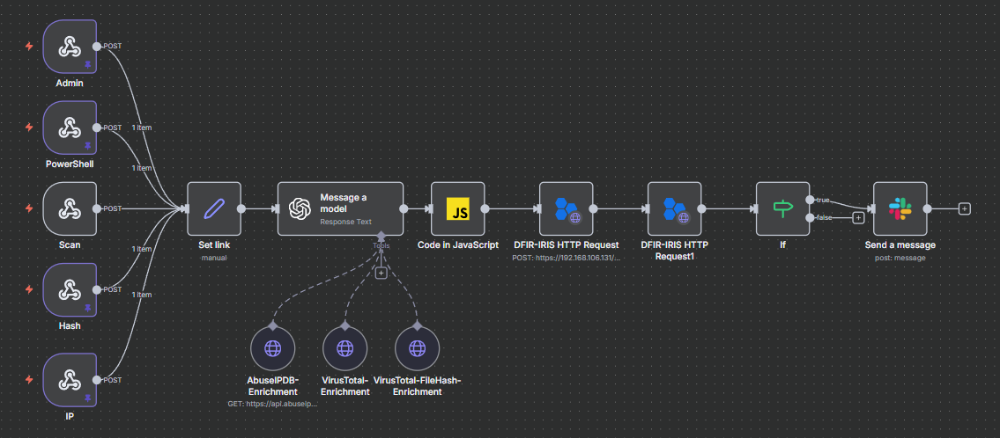

### Slack Alert — Critical Severity
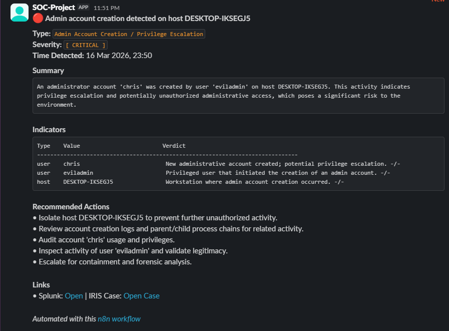

### DFIR-IRIS — Auto-Created Case
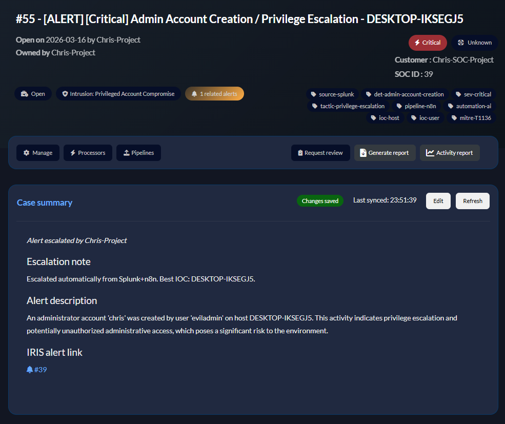

### DFIR-IRIS — Alert Queue
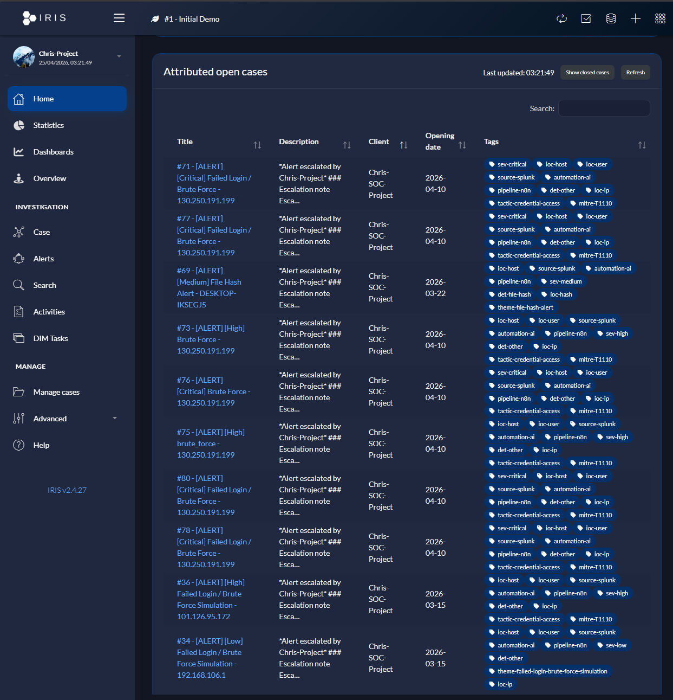

---

## Lab Environment

Deployed across **5 Virtual Machines** in VMware Workstation Pro on an isolated internal network (`192.168.106.0/24`):

| VM | OS | Role | IP |
|---|---|---|---|
| Windows Client | Windows 10 Pro | Endpoint telemetry source | 192.168.106.128 |
| Splunk Server | Ubuntu 24.04 | SIEM platform | 192.168.106.129 |
| n8n Server | Ubuntu 24.04 | SOAR & LLM orchestration | 192.168.106.130 |
| DFIR-IRIS Server | Ubuntu 24.04 | Case management | 192.168.106.131 |
| Kali Linux | Kali Linux | Attack simulation | 192.168.106.133 |

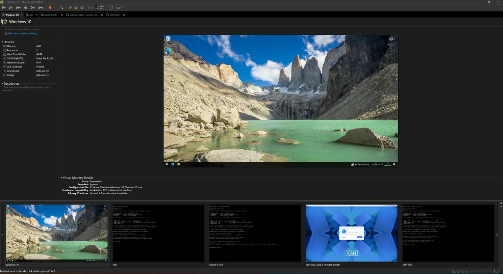

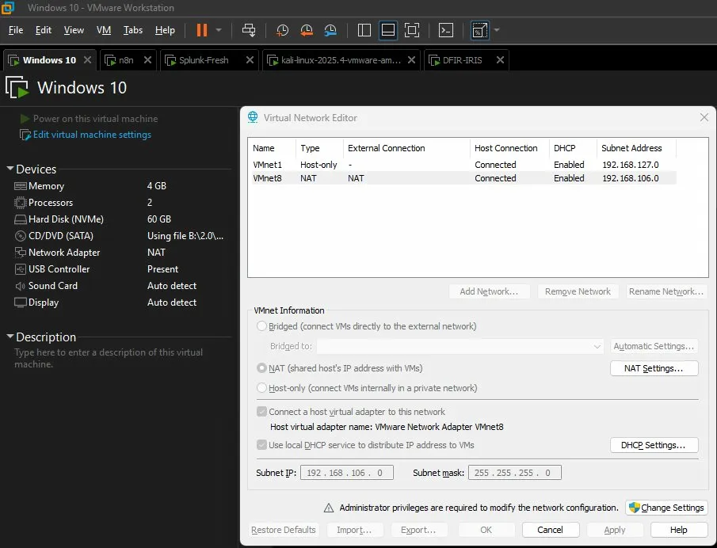

All attack traffic was generated within this isolated network. No real-world attack traffic was used at any point.

---

## Three Pipeline Configurations

### Pipeline A — Manual Baseline
Standard Tier 1 SOC analyst workflow with no automation. The analyst manually queries Splunk logs, consults AbuseIPDB and VirusTotal directly, assesses severity, documents findings, and initiates response actions. Establishes the performance baseline.

### Pipeline B — LLM-Only
Splunk alert is forwarded via webhook to n8n, which passes the structured alert to GPT-4.1 Mini for classification, severity assessment, and response recommendations. No external threat intelligence APIs are called. Isolates the contribution of LLM reasoning alone.

> Pipeline B was not a separate workflow — it was achieved by disabling the AbuseIPDB, VirusTotal, and VirusTotal-FileHash tool nodes in the same n8n workflow used for Pipeline C.

### Pipeline C — Fully Integrated (Primary)
Complete pipeline. LLM analysis is supplemented by real-time threat intelligence enrichment via AbuseIPDB (IP reputation) and VirusTotal (file hash and IP detection). Results are used to auto-create a case in DFIR-IRIS and deliver a formatted Slack notification for high-severity alerts.

---

## Attack Scenarios

Five simulated attack scenarios mapped to MITRE ATT&CK techniques:

| Scenario | MITRE Technique | Detection Source |
|---|---|---|
| Brute Force Authentication | T1110 | Windows Event ID 4625 |
| Malicious File Execution / Hash | T1059 / T1204 | Sysmon Event ID 1 |
| Suspicious IP / Network Scanning | T1046 | Windows Firewall logs |
| Privilege Escalation / Admin Account | T1136 / T1078 | Windows Event ID 4720 / 4732 |
| PowerShell-Based Attack | T1059.001 | Sysmon command-line telemetry |

### Splunk Detection Rules

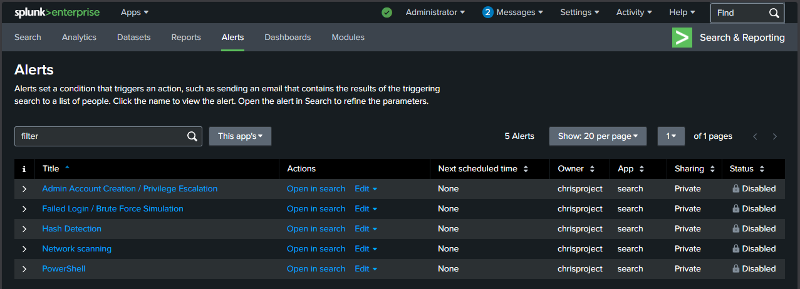

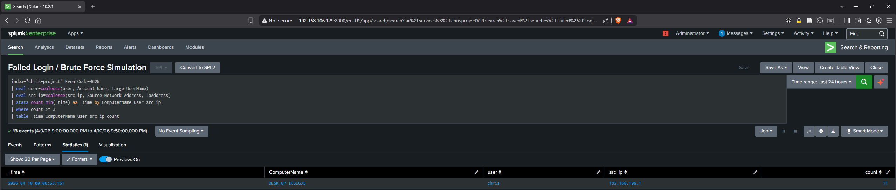

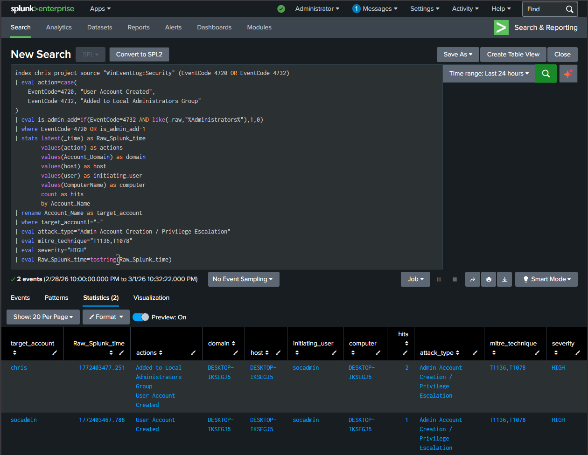

### Endpoint Telemetry — Sysmon

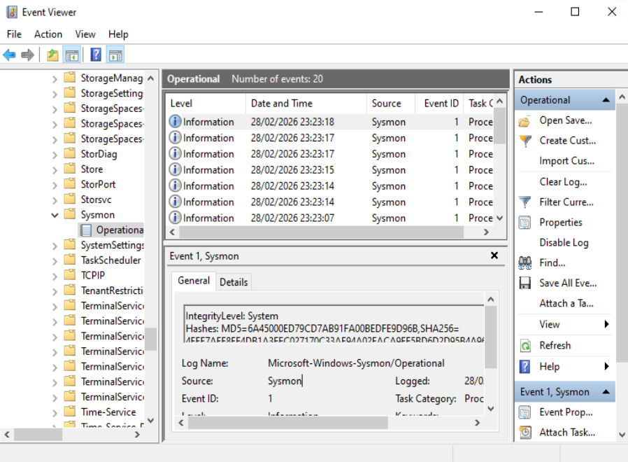

All scenarios were pre-verified to ensure correct detection before formal timing tests began. The 100% classification accuracy result reflects performance under controlled conditions against known, tested scenarios — not a claim of generalised real-world reliability.

---

## Key Results — Explained

### Why LLM-Only had *fewer* analyst steps than Fully Integrated
Pipeline B (LLM-Only) recorded a mean of 3.0 analyst steps vs 3.6 for Pipeline C. This is **not** because it was more efficient — it is because it skipped enrichment steps entirely. Threat intelligence lookups for IP reputation and file hash validation were simply absent, reducing step count through omission rather than optimisation. Pipeline C automates those same steps, delivering both lower workload and higher analytical depth.

### Why accuracy was 100% across all three modes
Each attack scenario was tested and verified to produce correct detections before formal evaluation runs began. Timing and quality data were only collected once the pipeline was confirmed to be working correctly. The 100% accuracy result therefore reflects consistent performance under controlled laboratory conditions with pre-validated scenarios, not performance against novel or adversarial inputs.

### Why context quality dropped for LLM-Only
GPT-4.1 Mini is capable of strong reasoning, but it can only work with the data it receives. Without AbuseIPDB and VirusTotal enrichment, the model has no external validation of indicators — it can classify the *type* of attack from log data alone, but cannot confirm whether an IP address is genuinely malicious or a file hash is known malware. Context quality is determined by enrichment depth, not model capability.

---

## Limitations

This project is an **academic proof-of-concept** in a controlled laboratory environment. Real-world deployment would require addressing:

| Limitation | Detail |
|---|---|
| **Cost** | OpenAI API and Splunk Enterprise are commercial. See alternatives below. |
| **Test scale** | 15 runs across 5 scenarios — sufficient for comparative evaluation, not production validation |
| **Simulated attacks** | All attacks generated on a local VMware network, not real-world traffic |
| **Manual timing** | Stage timestamps recorded manually with stopwatch application |
| **API dependency** | AbuseIPDB and VirusTotal rate limits and availability not stress-tested |
| **Single researcher** | Qualitative scoring applied by one person; structured rubric used to reduce subjectivity |
| **LLM non-determinism** | GPT-4.1 Mini outputs are probabilistic — identical inputs can produce varied outputs |

---

## Free & Open-Source Alternatives

This pipeline uses commercial tools. If you want to replicate it without cost, here are the alternatives evaluated in the dissertation:

### SIEM Alternatives to Splunk

| Tool | Type | Strengths | Limitations |
|---|---|---|---|
| **Wazuh** | Open-source | Purpose-built for security, free, good community support | Smaller ecosystem, fewer out-of-box integrations |
| **ELK Stack** (Elastic) | Open-source | Flexible, highly customisable, cost-effective | Requires significant expertise to configure and maintain |
| **Security Onion** | Open-source | Comprehensive network monitoring, training-friendly | Resource-heavy, limited scalability, on-premises only |
| **Microsoft Sentinel** | Cloud (Azure) | Scalable, low maintenance, integrates with Microsoft stack | Requires Azure, costs can escalate with data volume |

### LLM Alternatives to GPT-4.1 Mini (OpenAI API)

| Model | Type | Cost | Privacy | Notes |
|---|---|---|---|---|
| **Ollama + Mistral 7B** | Local / Open-source | Free | High — data stays local | Lightweight, fast, good for constrained environments |
| **Ollama + LLaMA** | Local / Open-source | Free | High — data stays local | Highly customisable, requires more hardware |
| **Claude (Anthropic)** | API / Proprietary | Medium–High | Moderate | Strong safety alignment, fewer n8n integration examples |
| **Google Gemini** | API / Proprietary | Medium | Moderate | Competitive reasoning capability |

**For a fully free, privacy-preserving setup:** replace the OpenAI node in n8n with an Ollama HTTP request node pointing to a locally hosted model. Mistral 7B is a practical starting point — lower accuracy than GPT-4.1 Mini but no API costs and all data stays within your network.

### SOAR Alternatives to n8n

| Tool | Type | Notes |
|---|---|---|
| **Shuffle** | Open-source | Purpose-built for security teams, growing integrations |
| **Splunk SOAR** | Commercial | Tight Splunk integration but expensive |
| **Cortex XSOAR** | Commercial | Feature-rich, very high cost |
| **StackStorm** | Open-source | Powerful but steep learning curve |

---

## Repository Structure

```
lara-soc-automation/
├── README.md
├── LICENSE
├── env.example                         ← API key template
├── workflows/
│   └── pipeline-c.json                ← n8n workflow export (fully integrated)
│                                          Pipeline B = disable AbuseIPDB + VirusTotal nodes
│                                          Pipeline A = manual baseline, no automation
├── splunk/
│   └── detection-rules.md             ← All 5 SPL queries with explanation
├── results/
│   └── evaluation-results.csv         ← All 15 test runs raw data
├── screenshots/
│   ├── incident-response-workflow.png
│   ├── workflow-canvas.png
│   ├── slack-notification.png
│   ├── dfir-iris-case.png
│   ├── dfir-iris-cases-list.png
│   ├── splunk-alerts.png
│   ├── splunk-brute-force-detection.png
│   ├── splunk-admin-detection.png
│   ├── sysmon-event-viewer.png
│   ├── lab-network-topology.png
│   ├── vmware-lab-overview.png
│   └── vmware-network-config.png
└── docs/
    ├── attack-scenarios.md
    ├── lab-environment.md
    └── prompts-and-code.md
```

---

## Setup Overview

> Full step-by-step instructions are in [`docs/lab-environment.md`](docs/lab-environment.md)

**Prerequisites:**
- VMware Workstation Pro (or VirtualBox)
- Ubuntu 24.04 ISOs × 3, Windows 10 Pro ISO × 1, Kali Linux ISO × 1
- Splunk Enterprise (trial or developer licence)
- Docker + Docker Compose (for n8n and DFIR-IRIS)
- API keys — see [`env.example`](env.example)

**Required API keys:**
- OpenAI API key (GPT-4.1 Mini) — or substitute a local Ollama model
- AbuseIPDB API key (free tier available)
- VirusTotal API key (free tier available)
- DFIR-IRIS API key (generated post-deployment)
- Slack Incoming Webhook URL

---

## Tech Stack

`Splunk` `n8n` `GPT-4.1 Mini` `AbuseIPDB` `VirusTotal` `DFIR-IRIS` `Slack` `VMware` `Docker` `Ubuntu 24.04` `Windows 10` `Kali Linux` `Sysmon` `JavaScript`

---

## Academic Context

This project was developed as an Honours Dissertation for a BEng (Hons) Cyber Security degree at the University of the West of Scotland (2025–2026). The system was designed, implemented, and formally evaluated as primary research — not a tutorial follow-along.

The dissertation examines orchestration depth as the primary driver of AI-assisted SOC performance, contributing a comparative evaluation framework that distinguishes between the independent contributions of LLM reasoning and external threat intelligence enrichment.

---

## Disclaimer

This project was built for academic research and educational purposes in a fully isolated lab environment. All attack scenarios were simulated within a local VMware network. No real systems, networks, or data were targeted or compromised at any point.

---

## Connect

**LinkedIn:** [Christopher Andrews](https://www.linkedin.com/in/christopher-andrews-958b30248/)  
**Dissertation:** Available on request
