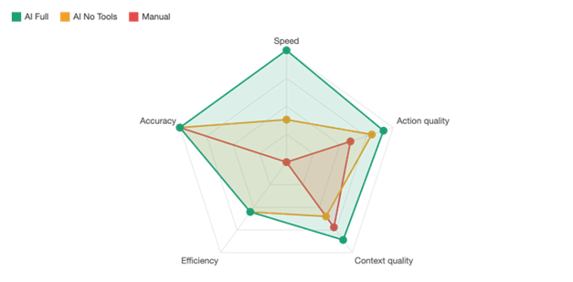

# Evaluation Results

This folder contains the raw data and analysis from the formal evaluation of the LARA pipeline across three configurations and five attack scenarios.

**Files:**
- `evaluation-results.csv` — raw data for all 15 test runs
- `dashboard.html` — interactive analysis dashboard (open locally in a browser)

---

## Methodology

### Test Structure
- **15 runs total** across 3 pipeline configurations and 5 attack scenarios
- Each scenario was run at least once per applicable pipeline configuration
- Pipeline B (LLM-Only) was not tested against Admin Escalation or PowerShell scenarios — neither involves external IP indicators or file hashes, so AbuseIPDB and VirusTotal provide no enrichment value for these alert types

### Timing
Triage time was measured from the moment the Splunk alert fired (alert timestamp) to the completion of the final pipeline action — either Slack notification delivery (Pipelines B and C) or manual documentation completion (Pipeline A).

Timestamps were recorded manually using a stopwatch application running alongside the pipeline. Times include:
- Splunk detection and alert trigger
- Webhook delivery to n8n
- LLM processing time (including tool calls for enrichment)
- DFIR-IRIS case creation
- Slack notification delivery

### Quality Scoring
Two quality dimensions were scored on a 1–5 rubric after each run:

**Action Quality** — How useful and specific were the recommended actions?
| Score | Description |
|---|---|
| 5 | Highly specific, actionable, contextually accurate recommendations |
| 4 | Good recommendations with minor gaps |
| 3 | Generic but correct recommendations |
| 2 | Partially relevant, missing key actions |
| 1 | Irrelevant or incorrect recommendations |

**Context Quality** — How well did the pipeline explain the threat and its indicators?
| Score | Description |
|---|---|
| 5 | Rich contextual explanation with validated threat intelligence |
| 4 | Good context with minor gaps |
| 3 | Basic explanation, correct but limited depth |
| 2 | Minimal context, missing key details |
| 1 | Poor or inaccurate contextual information |

Scoring was applied by a single researcher using this rubric consistently across all runs. The rubric was defined before testing began to minimise subjectivity.

### Analyst Steps
Steps were counted as discrete analyst actions required to complete triage. For Pipeline A (Manual), this included actions like: open Splunk, run search, copy IP, open AbuseIPDB, check result, open DFIR-IRIS, create case, document findings. For Pipelines B and C, steps were limited to reviewing the automated output and confirming or escalating.

---

## Overall Results

| Mode | Avg Time (s) | Avg Action Quality | Avg Context Quality | Avg Steps | vs Manual |
|---|---|---|---|---|---|
| **AI Full (Pipeline C)** | 38.1 | 4.57 / 5 | 4.29 / 5 | 3.6 | ↓ 82% |
| **AI No Tools (Pipeline B)** | 130.0 | 4.00 / 5 | 3.00 / 5 | 3.0 | ↓ 38% |
| **Manual (Pipeline A)** | 209.0 | 3.00 / 5 | 3.60 / 5 | 6.6 | — |

---

## Results by Attack Type

| Attack Type | AI Full (s) | AI No Tools (s) | Manual (s) | AI Full improvement |
|---|---|---|---|---|
| Brute Force | 43.0 | 160.0 | 210.0 | ↓ 80% |
| File Hash | 40.5 | 120.0 | 220.0 | ↓ 82% |
| PowerShell | 34.0 | — | 185.0 | ↓ 82% |
| Network Scanning | 35.2 | 110.0 | 260.0 | ↓ 86% |
| Admin Escalation | 30.6 | — | 170.0 | ↓ 82% |

---

## Key Findings

**Speed:** The AI Full pipeline achieves an overall average of 38.1 seconds compared to 209 seconds for manual analysis — an overall improvement of 82%. The strongest gains are in Network Scanning (35.2s vs 260s, ~86% faster) and Admin Escalation (30.6s vs 170s, ~82% faster).

**Quality:** The AI Full pipeline produces the highest quality outputs across both dimensions. Average action quality of 4.57/5 and average context quality of 4.29/5 versus manual scores of 3.0/5 and 3.6/5 respectively. The AI No Tools mode matches action quality at 4.0/5 but falls short on context (3.0/5) — confirming that external tool integration is the primary driver of contextual enrichment depth, not LLM capability alone.

**Analyst steps:** Both AI-assisted modes reduced analyst steps from an average of 6.6 (manual) to 3.6 (AI Full) and 3.0 (AI No Tools) — a reduction of approximately 45–55%. Automation of case creation, alert formatting, and enrichment significantly reduces cognitive load for Tier 1 analysts.

**The AI No Tools trade-off:** Pipeline B achieved fewer analyst steps than Pipeline C (3.0 vs 3.6) — not because it was more efficient, but because it skipped enrichment steps entirely. The reduction in steps comes from omission rather than optimisation. Pipeline C automates those same steps and delivers higher contextual quality as a result.

**Accuracy:** Classification accuracy was 100% across all three pipeline modes and all 15 runs. All scenarios were pre-verified before formal evaluation began — this result reflects consistent performance under controlled conditions, not generalised real-world reliability.

---

## Limitations

- 15 runs is sufficient for comparative evaluation but not production-grade statistical validation
- Manual timing introduces human error of approximately ±1–2 seconds per run
- Quality scoring applied by a single researcher — inter-rater reliability was not tested
- All scenarios were simulated on a local VMware network with pre-validated detection rules
- LLM outputs are probabilistic — identical inputs may produce varied outputs across runs
- GPT-4.1 Mini API costs were not tracked per-run but are a real-world consideration for production deployment

---

## Interactive Dashboard

For the full interactive analysis — including colour-coded data tables, per-attack-type breakdowns, and Chart.js visualisations — open `dashboard.html` locally in any browser.
